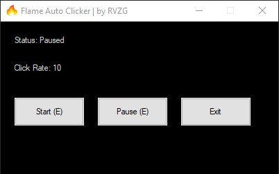

# Flame Auto Clicker — RVZG
## Screenshot

---

## English

This auto clicker is configured to perform 10 clicks per millisecond.  
If you need a faster clicker or custom features, contact us:  
- Instagram: [@rvzgg](https://www.instagram.com/rvzgg)  
- Discord: @rvzg  

**VirusTotal scan:**  
[Link](https://www.virustotal.com/gui/file/c0e248c55e46d3d47cff0cab2e2545fbb87f11e46bffcb8d393307a94a52b3b2)

**Note:** Using more than 10 clicks per millisecond may cause lag or unexpected behavior in some applications. Use responsibly.

### Usage Instructions
- Press the **E** key to start or stop clicking.
- You can also use the Start/Stop buttons in the GUI.
- The click rate is set in the compiled script and displayed in the GUI.

### Disclaimer / Terms of Use
- This software is for **personal use only**.
- Do **not** use this software to cheat, break rules, or violate the terms of service of other applications.
- RVZG is **not responsible** for any data loss, account bans, or system issues resulting from misuse.
- **Tampering Warning:** Modifying the script or executable to bypass protections, automate prohibited behavior, or redistribute altered versions may cause serious malfunctions and legal consequences.

### FAQ / Tips
1. **Click Rate:** The `clickRate` in the script controls the speed of clicking. Excessive values may cause lag or instability.  
   - Recommended safe limit: 10 clicks per millisecond.
2. **GUI Status:** "Clicker Status: On/Off" shows whether clicking is active.
3. **E Key:** Toggle (start/stop) function; works the same as the GUI buttons.
4. **System Resources:** Very high click rates can increase CPU usage.
5. **Support:** Contact via Instagram [@rvzgg](https://www.instagram.com/rvzgg) or Discord @rvzg for custom builds or faster clicking.

---

## Türkçe

Bu otomatik tıklayıcı, her milisaniyede 10 tıklama yapacak şekilde ayarlanmıştır.  
Daha hızlı bir tıklayıcı veya özel özellikler için iletişime geçin:  
- Instagram: [@rvzgg](https://www.instagram.com/rvzgg)  
- Discord: @rvzg

**VirusTotal taraması:**  
[Link](https://www.virustotal.com/gui/file/c0e248c55e46d3d47cff0cab2e2545fbb87f11e46bffcb8d393307a94a52b3b2)

**Not:** Milisaniyede 10’dan fazla tıklama bazı uygulamalarda gecikme (lag) veya beklenmeyen davranışlara yol açabilir. Lütfen sorumlu şekilde kullanın.

### Kullanım Talimatları
- **E** tuşuna basarak tıklamayı başlatıp durdurun.
- GUI’deki Başlat/Durdur butonlarını kullanabilirsiniz.
- Tıklama hızı derlenmiş scriptte ayarlıdır ve GUI’de gösterilir.

### Sorumluluk Reddi / Kullanım Koşulları
- Bu yazılım yalnızca **kişisel kullanım** içindir.
- Yazılımı oyun/uygulama kurallarını ihlal etmek, hile yapmak veya yetkisiz erişim için kullanmayın.
- RVZG, kötüye kullanım sonucu oluşabilecek veri kaybı, hesap banı veya sistem sorunlarından sorumlu değildir.
- **Değiştirme Uyarısı:** Scripti veya EXE’yi değiştirerek korumaları aşmaya, yasadışı davranışları otomatikleştirmeye veya değiştirilmiş sürümleri dağıtmaya çalışmak ciddi sistem arızalarına ve yasal sorumluluğa yol açabilir.

### SSS / İpuçları
1. **Tıklama Hızı:** Scriptteki `clickRate` değeri tıklama hızını belirler; aşırı değerler lag veya kararsızlığa neden olabilir.  
   - Önerilen güvenli limit: milisaniyede 10 tıklama.
2. **GUI Durumu:** "Clicker Durumu: Açık/Kapalı" tıklamanın aktif olup olmadığını gösterir.
3. **E tuşu:** Başlat/durdur toggle işlevi görür; GUI butonları ile aynı.
4. **Sistem Kaynakları:** Çok yüksek `clickRate` değerleri CPU kullanımını artırabilir.
5. **Destek:** Daha hızlı tıklama veya özelleştirme için Instagram [@rvzgg](https://www.instagram.com/rvzgg) veya Discord @rvzg üzerinden iletişime geçebilirsiniz.
