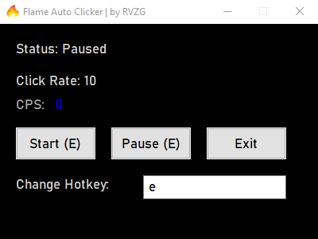

# Flame Auto Clicker — RVZG
## Pretty Simple GUI - Showcase

---

This auto clicker is configured to perform 10 clicks per millisecond.  
If you need a faster clicker or custom features, contact us:  
- Instagram: [@rvzgg](https://www.instagram.com/rvzgg)  
- Discord: @rvzg  

**VirusTotal scan:**  
[Link](https://www.virustotal.com/gui/file/93820cc3bcb0fb2a031796e471b7b2214e1f7b26979a5fa0eea498df42fc99d3)

**Note:** Using more than 10 clicks per millisecond may cause lag or unexpected behavior in some applications. Use responsibly.

### Hotkey & Customization
- The clicker hotkey can be changed directly from the GUI.
- Only **letters (A-Z) and numbers (0-9)** are supported. Function keys (F1-F12) and special keys are not recognized.
- **Hotkey Preference Saving:** The selected hotkey is saved automatically in a preference file. When the program is restarted, it will remember your last chosen hotkey.
- If the preference file is deleted, the program will recreate it and default to **E**.

### Click Rate / Versions
- **5 clicks/ms = 300 CPS:** Slower, less lag – safe for heavy applications.
- **10 clicks/ms = 600 CPS:** Stable, recommended default.
- **15 clicks/ms = 900 CPS:** Very fast, may cause lag in some apps.
- **20 clicks/ms = 1200 CPS:** For high system computers. If your computer is not sufficient, do not use!
- **25 clicks/ms = 1500 CPS:** For high system computers. If your computer is not sufficient, do not use!
- Use whichever version fits your needs; the click rate is set in the compiled script and displayed in the GUI.

### Usage Instructions
- Press the hotkey to start or stop clicking.
- You can also use the Start/Stop buttons in the GUI.
- The click rate and CPS are displayed in the GUI.

### FAQ / Tips
1. **Click Rate:** The `clickRate` in the script controls the speed of clicking. Excessive values may cause lag or instability.
2. **GUI Status:** "Clicker Status: On/Off" shows whether clicking is active.
3. **CPS:** Displays your current clicks per second in real-time.
4. **Hotkey:** Toggle (start/stop) function; works the same as the GUI buttons.
5. **Hotkey Preferences:** The selected hotkey is saved in a preference file and loaded automatically on next launch.
6. **System Resources:** Very high click rates can increase CPU usage.
7. **Support:** Contact via Instagram [@rvzgg](https://www.instagram.com/rvzgg) or Discord @rvzg for custom builds or faster clicking.

### Disclaimer / Terms of Use
- This software is for **personal use only**.
- Do **not** use this software to cheat, break rules, or violate the terms of service of other applications.
- RVZG is **not responsible** for any data loss, account bans, or system issues resulting from misuse.
- **Tampering Warning:** Modifying the script or executable to bypass protections, automate prohibited behavior, or redistribute altered versions may cause serious malfunctions and legal consequences.
