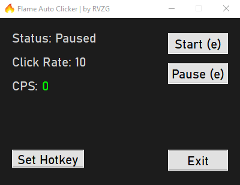

# Flame Auto Clicker — RVZG
## Pretty Simple GUI - Showcase

---

## English

This auto clicker is configured to perform 10 clicks per millisecond.  
If you need a faster clicker or custom features, contact us:  
- Instagram: [@rvzgg](https://www.instagram.com/rvzgg)  
- Discord: @rvzg  

**VirusTotal scan:**  
[Link](https://www.virustotal.com/gui/file/c0e248c55e46d3d47cff0cab2e2545fbb87f11e46bffcb8d393307a94a52b3b2)

**Note:** Using more than 10 clicks per millisecond may cause lag or unexpected behavior in some applications. Use responsibly.

### Hotkey & Customization
- The clicker hotkey can be changed directly from the GUI.
- Only **letters (A-Z) and numbers (0-9)** are supported. Function keys (F1-F12) and special keys are not recognized.
- Press your desired key in the hotkey box to change the toggle key.

### Click Rate / Versions
- **5 clicks/ms = 300 CPS:** Slower, less lag – safe for heavy applications.
- **10 clicks/ms = 600 CPS:** Stable, recommended default.
- **15 clicks/ms = 900 CPS:** Very fast, may cause lag in some apps.
- Use whichever version fits your needs; the click rate is set in the compiled script and displayed in the GUI.

### New Features
- **CPS (Clicks Per Second) Display:** Shows your current click speed in real-time. The label is grey, the changing value is blue.
- **Left/Right Mouse Click:** Option to switch between left and right mouse button clicks.
- **Smart Pause:** Automatically pauses the clicker when certain conditions are met (e.g., typing or specific windows active).
- **Animated Status:** The "Running/Paused" status smoothly animates when changing.
- **Minimize to Tray:** The GUI can be minimized to system tray without stopping the clicker.

### Usage Instructions
- Press the hotkey (default **E**) to start or stop clicking.
- You can also use the Start/Stop buttons in the GUI.
- The click rate and CPS are displayed in the GUI.

### Disclaimer / Terms of Use
- This software is for **personal use only**.
- Do **not** use this software to cheat, break rules, or violate the terms of service of other applications.
- RVZG is **not responsible** for any data loss, account bans, or system issues resulting from misuse.
- **Tampering Warning:** Modifying the script or executable to bypass protections, automate prohibited behavior, or redistribute altered versions may cause serious malfunctions and legal consequences.

### FAQ / Tips
1. **Click Rate:** The `clickRate` in the script controls the speed of clicking. Excessive values may cause lag or instability.
2. **GUI Status:** "Clicker Status: On/Off" shows whether clicking is active, with animated transitions.
3. **CPS:** Displays your current clicks per second.
4. **Hotkey:** Toggle (start/stop) function; works the same as the GUI buttons.
5. **Mouse Button:** You can choose between left or right click.
6. **System Resources:** Very high click rates can increase CPU usage.
7. **Support:** Contact via Instagram [@rvzgg](https://www.instagram.com/rvzgg) or Discord @rvzg for custom builds or faster clicking.

---

## Türkçe

Bu otomatik tıklayıcı, her milisaniyede 10 tıklama yapacak şekilde ayarlanmıştır.  
Daha hızlı bir tıklayıcı veya özel özellikler için iletişime geçin:  
- Instagram: [@rvzgg](https://www.instagram.com/rvzgg)  
- Discord: @rvzg

**VirusTotal taraması:**  
[Link](https://www.virustotal.com/gui/file/c0e248c55e46d3d47cff0cab2e2545fbb87f11e46bffcb8d393307a94a52b3b2)

**Not:** Milisaniyede 10’dan fazla tıklama bazı uygulamalarda gecikme (lag) veya beklenmeyen davranışlara yol açabilir. Lütfen sorumlu şekilde kullanın.

### Hotkey & Özelleştirme
- Tıklayıcıyı başlat/durduracak hotkey, GUI üzerinden değiştirilebilir.
- Sadece **harfler (A-Z) ve sayılar (0-9)** desteklenir. F1-F12 veya özel tuşlar çalışmaz.
- Hotkey kutusuna basıp istediğiniz tuşu seçin.

### Tıklama Hızı / Sürümler
- **5 tıklama/ms = 300 CPS:** Daha yavaş, daha az lag – yoğun uygulamalar için güvenli.
- **10 tıklama/ms = 600 CPS:** Stabil, önerilen varsayılan sürüm.
- **15 tıklama/ms = 900 CPS:** Çok hızlı, bazı uygulamalarda lag oluşabilir.
- İhtiyacınıza uygun sürümü kullanabilirsiniz; tıklama hızı derlenmiş scriptte ayarlıdır ve GUI’de gösterilir.

### Yeni Özellikler
- **CPS (Saniyede Tıklama) Gösterimi:** Anlık tıklama hızınızı gösterir. Etiket gri, değişen değer mavi renktedir.
- **Sol/Sağ Tıklama:** Fare butonunu sol veya sağ olarak seçebilirsiniz.
- **Smart Pause:** Belirli durumlarda otomatik olarak tıklamayı durdurur (ör. yazı yazarken veya belirli pencereler aktifken).
- **Animasyonlu Durum:** "Çalışıyor/Durduruldu" durumu geçişlerde yumuşak animasyon gösterir.
- **Simge Durumuna Küçültme:** GUI’yi sistem tepsisine küçülterek tıklamayı durdurmadan devam ettirebilirsiniz.

### Kullanım Talimatları
- **E** tuşuna veya seçtiğiniz hotkeye basarak tıklamayı başlatıp durdurun.
- GUI’deki Başlat/Durdur butonlarını da kullanabilirsiniz.
- Tıklama hızı ve CPS GUI’de gösterilir.

### Sorumluluk Reddi / Kullanım Koşulları
- Bu yazılım yalnızca **kişisel kullanım** içindir.
- Yazılımı oyun/uygulama kurallarını ihlal etmek, hile yapmak veya yetkisiz erişim için kullanmayın.
- RVZG, kötüye kullanım sonucu oluşabilecek veri kaybı, hesap banı veya sistem sorunlarından sorumlu değildir.
- **Değiştirme Uyarısı:** Scripti veya EXE’yi değiştirerek korumaları aşmaya, yasadışı davranışları otomatikleştirmeye veya değiştirilmiş sürümleri dağıtmaya çalışmak ciddi sistem arızalarına ve yasal sorumluluğa yol açabilir.

### SSS / İpuçları
1. **Tıklama Hızı:** Scriptteki `clickRate` değeri tıklama hızını belirler; aşırı değerler lag veya kararsızlığa neden olabilir.
2. **GUI Durumu:** "Clicker Durumu: Açık/Kapalı" tıklamanın aktif olup olmadığını gösterir, animasyonlu geçişlerle.
3. **CPS:** Anlık tıklama hızınızı gösterir.
4. **Hotkey:** Başlat/durdur toggle işlevi görür; GUI butonları ile aynı.
5. **Fare Butonu:** Sol veya sağ tıklamayı seçebilirsiniz.
6. **Sistem Kaynakları:** Çok yüksek `clickRate` değerleri CPU kullanımını artırabilir.
7. **Destek:** Daha hızlı tıklama veya özelleştirme için Instagram [@rvzgg](https://www.instagram.com/rvzgg) veya Discord @rvzg üzerinden iletişime geçebilirsiniz.
